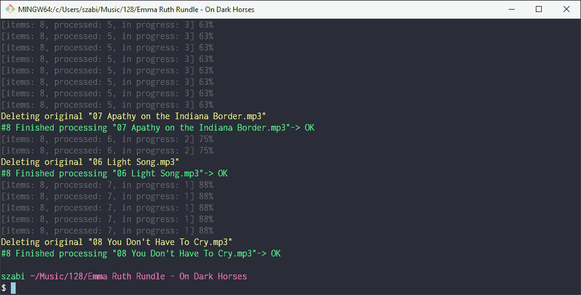

# 128ify

Convert audio files to low bitrate mp3 files.

I backup my purchased music files locally, but sometimes I want to
listen them on the go, without messing around with iTunes or other crap,
so:

1. buy stuff on [Bandcamp](https://bandcamp.com), save to mp3 server on LAN
2. downgrade files at local copy
3. upload to own cloud
4. use a cloud player to download them to iDevice
5. enjoy



Shellscript only works on Linux, this node script is meant to be crossplatform.

## TODO

- [x] basic functionality (mirrors old shellscript)
- [x] colors
- [x] parallel encoding
- [ ] better rename
- [ ] auto copy to sync dir

## install

Git clone, npm install, then create a shellscript somewhere on your path...

```cmd
@node %HOMEPATH%\Projects\personal\128ify %*
```

```sh
#!/usr/bin/env bash
node $HOME/Projects/personal/128ify "$@"
```
